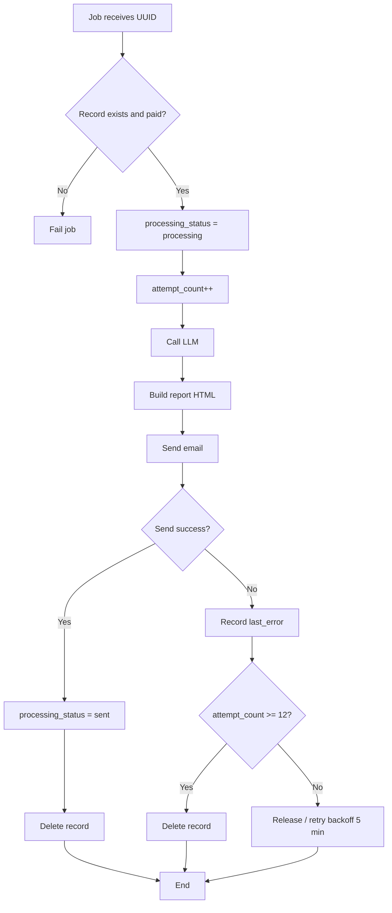

# FDR-005: Analysis processing job

**Feature:** 5  
**Reference:** docs/04 - Features.md, ADR-015, ADR-011, docs/LLM Prompt Template.md

---

## How it works

- Job `ProcessAnalysisRequest` receives the analysis request UUID. It is enqueued by the Stripe webhook (FDR-004) when `checkout.session.completed` is confirmed.
- **Flow:** (1) Load record from `analysis_requests` where `payment_status = paid`; if it does not exist or is not paid, fail the job (release/fail). (2) Update `processing_status = processing`, increment `attempt_count`. (3) Call LLM integration (FDR-007) with record data and locale; get structured content. (4) Build report HTML (sections: Executive Summary, Profile Score, Inferred Niche, Username Suggestions, Optimized Bio, Profile Optimization, Content Ideas, Viralization Tips, 30-Day Action Plan). (5) Send email with that HTML (FDR-008). (6) On success: update `processing_status = sent` and delete the record. On failure: record `last_error`; release the job for retry (backoff 5 min); after 12 total attempts, mark as failed and delete the record (per ADR-011).

Flow diagram (Mermaid):

Reference: [Mermaid Flowcharts](https://mermaid.ai/open-source/syntax/flowchart.html).

---

## How to test

- **Happy path:** Record paid and queued; job runs; LLM returns content; email sent; record becomes sent and is deleted.
- **LLM failure:** Simulate timeout or API error; job releases; attempt_count increases; after 12 attempts, record is marked failed and deleted; last_error set.
- **Email failure:** Simulate SES failure; same retry behavior and, after 12 attempts, failed + delete.
- **Edge cases:** (1) Record already deleted (duplicate or delayed job): job should fail gracefully without unhandled exception. (2) Record with payment_status != paid: job must not process (fail/release). (3) Malformed LLM content: handle or fail with clear last_error for debug. (4) Idempotency: do not send two emails for the same record on retry.

---

## Acceptance criteria

- [ ] Job dispatched by webhook (FDR-004) with record id.
- [ ] Processing: processing → LLM → build HTML → send email; on success: sent + delete.
- [ ] On failure: last_error recorded; retry with backoff (e.g. 5 min); max 12 attempts; after 12: failed + delete.
- [ ] Only records with payment_status = paid are processed.
- [ ] Report structure follows the sections defined in the PRD/template.

---

## Deployment notes

- Worker must be running (queue:work or equivalent). Job timeout must be greater than LLM latency + email send (e.g. 120–300 s). Queue: Redis (FDR-006).
