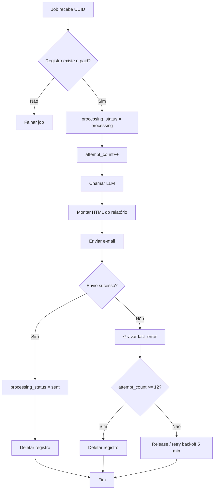

# FDR-005: Job de processamento da análise

**Feature:** 5  
**Referência:** docs/04 - Features.md, ADR-015, ADR-011, docs/LLM Prompt Template.md

---

## Como funciona

- Job `ProcessAnalysisRequest` recebe o UUID da requisição de análise. É enfileirado pelo webhook Stripe (FDR-004) quando `checkout.session.completed` é confirmado.
- **Fluxo:** 
    1. Carregar registro de `analysis_requests` onde `payment_status = paid`; se não existir ou não estiver paid, falhar o job (release/fail). 
    2. Atualizar `processing_status = processing`, incrementar `attempt_count`. 
    3. Chamar integração LLM (FDR-007) com dados do registro e locale; obter conteúdo estruturado. 
    4. Montar HTML do relatório (seções: Executive Summary, Profile Score, Inferred Niche, Username Suggestions, Optimized Bio, Profile Optimization, Content Ideas, Viralization Tips, 30-Day Action Plan). 
    5. Enviar e-mail com esse HTML (FDR-008). 
    6. Em sucesso: atualizar `processing_status = sent`. Em falha: gravar `last_error`; fazer release do job para retry (backoff 5 min); após 12 tentativas totais, marcar como failed e deletar o registro (conforme ADR-011).

Diagrama do fluxo (Mermaid):

Referência: [Mermaid Flowcharts](https://mermaid.ai/open-source/syntax/flowchart.html).

---

## Como testar

- **Happy path:** Registro paid e queued; job roda; LLM retorna conteúdo; email enviado; registro fica sent e é deletado.
- **Falha LLM:** Simular timeout ou erro da API; job faz release; attempt_count sobe; após 12 tentativas, registro é marcado failed e deletado; last_error preenchido.
- **Falha e-mail:** Simular falha do SES; mesmo comportamento de retry e, após 12 tentativas, failed + delete.
- **Edge cases:** 
    - Registro já deletado (job duplicado ou atrasado): job deve falhar gracefully sem exception não tratada. 
    - Registro com payment_status != paid: job não deve processar (fail/release). 
    - Conteúdo do LLM malformado: tratar ou falhar com last_error claro para debug. 
    - Idempotência: não enviar dois e-mails para o mesmo registro em caso de retry.

---

## Critérios de aceitação

- [ ] Job disparado pelo webhook (FDR-004) com id do registro.
- [ ] Processamento: processing → LLM → montagem HTML → envio e-mail; em sucesso: sent + delete.
- [ ] Em falha: last_error gravado; retry com backoff (ex.: 5 min); máx. 12 tentativas; após 12: failed + delete.
- [ ] Apenas registros com payment_status = paid são processados.
- [ ] Estrutura do relatório segue as seções definidas no PRD/template.

---

## Notas de deployment

- Worker deve estar rodando (queue:work ou equivalente). Timeout do job deve ser maior que latência LLM + envio de e-mail (ex.: 120–300 s). Fila: Redis (FDR-006).
